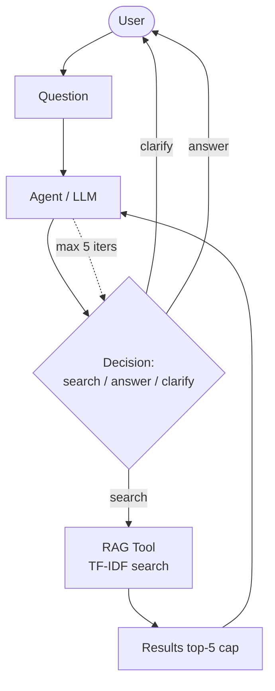

# W16 Agentified Assistant

## Agentic Pattern

Single-agent loop (`run_agent`, max 5 iterations): each iteration the model returns
`{"action": "search|answer|clarify", "query", "reason"}` based on the previous tool
result. One agent is enough — the task is a single decide-act-observe loop with one
tool, so extra agents would add unnecessary coordination and token overhead for this
relatively focused task.

## Setup

```bash
cp .env.example .env   # optional; set GROQ_API_KEY for live LLM decisions
# conda (if available): conda env create -f environment.yml && conda activate ml
python3 eval.py            # normal run -> results.md
python3 eval.py --fail     # failure-injection run
python3 agent.py "What is the refund policy?"
```

## Evaluation Harness

`eval.py` (written from scratch, no framework) runs 6 queries against the real agent
and records success, iterations (trajectory length), tool calls + correctness, tokens,
and failure class. Task completion rate = successful / total.

## Failure Injection

`FAILURE_INJECTION = True` (`rag_tool.py`, toggled via `python3 eval.py --fail` or
`python3 agent.py "<q>" --fail`) makes `search()` raise `TimeoutError`. The agent sees
the error in history and abstains/asks to clarify instead of fabricating — verified:
`... timeout (FAILURE_INJECTION=True)` → `"Could you clarify ... no evidence, cannot
answer confidently."` Normal mode is unaffected (flag defaults to `False`).

## Skill vs Agent

This capability could partially be implemented as a Skill, but an agent is more
appropriate because the number and order of tool calls must depend on intermediate results.

## Tool vs Agent Boundary

The document search system is modeled as a bounded tool call because it receives a
query and returns a finite set of documents. The main agent decides when and how often
to call it, so giving the search system its own agent would add unnecessary coordination.

## Architecture


(see also `architecture.mmd`)

## Evaluation Results

| Query | Success | Iterations | Tool Calls | Tool OK | Tokens | Failure |
|---|---|---:|---:|---|---:|---|
| What is the refund policy? | Yes | 2 | 1 | Yes | 326 | - |
| How long does standard shipping take? | Yes | 2 | 1 | Yes | 341 | - |
| How do I reset my password? | Yes | 2 | 1 | Yes | 319 | - |
| What are the library opening hours? | Yes | 2 | 1 | Yes | 470 | - |
| What does the warranty cover? | Yes | 2 | 1 | Yes | 313 | - |
| Hi | Yes | 1 | 0 | Yes | 119 | - |
| How do I get my money back? | Yes | 3 | 2 | Yes | 364 | - |

Task completion rate = 7/7 = 100%

Token note: without an API key, tokens use the closest reliable measure
(~1 token / 4 chars, stated, not invented); with `GROQ_API_KEY` (or `OPENAI_API_KEY`)
set, real `usage` tokens from the API are recorded. Failures: Hard (crash/confident fabrication), Soft
(clarify/max-iters on answerable query), Cascading soft (tool error → abstain).
